

# 화면 모음

[README로 돌아가기](README.md)

화면은 1.3.0 기준입니다. 곡과 앨범아트, 배경 사진은 모두 생성형 AI로 만든 예시 자료입니다.

## 감상 화면

같은 앱에서 배경, 테마, 파형, 가사 위치와 화면 배율을 바꿔 본 모습입니다.

<table>
  <tr>
    <td width="50%" align="center"> 어둡게 · 앨범아트 배경 · 둘레 파형(막대 · 선셋) · 오렌지</td>
    <td width="50%" align="center"> 사진 배경 · 하단 파형(피크 · 네온) · 가운데 가사 · 배율 110%</td>
  </tr>
  <tr>
    <td width="50%" align="center"> 밝게 · 사진 배경 · 하단 파형(라인 · 크롬) · 모노</td>
    <td width="50%" align="center"> 왼쪽 가사 · 둘레 파형(막대 · 포레스트) · 그린 · 펼친 메뉴</td>
  </tr>
  <tr>
    <td width="50%" align="center"> 밝게 · 사진 배경 · 둘레 파형(블록 · 레트로) · 앰버 · 배율 110%</td>
    <td width="50%" align="center">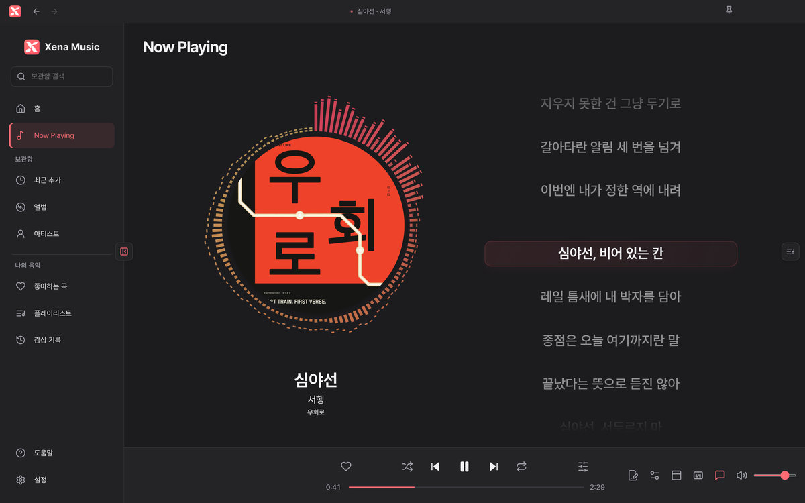 어둡게 · 단색 배경 · 둘레 파형(피크 · 캠프파이어) · 코랄</td>
  </tr>
  <tr>
    <td width="50%" align="center"> 밝게 · 단색 배경 · 한 줄 가사 · 하단 파형(면형 · 코튼캔디) · 배율 125%</td>
    <td width="50%" align="center"> 연주곡 · 가사 숨기기 · 둘레 파형(도트 · 오로라) · 바이올렛</td>
  </tr>
  <tr>
    <td width="50%" align="center"> 플로팅 가사</td>
    <td width="50%" align="center"> 재생 대기열</td>
  </tr>
</table>

### 창 크기

<table>
  <tr>
    <td width="50%" align="center"> 작은 창 (1024 × 720)</td>
    <td width="50%" align="center"> 큰 화면 (2560 × 1440) · 배율 125%</td>
  </tr>
  <tr>
    <td width="50%" align="center"> 전체 화면 · 하단 파형(막대 · 레모네이드) · 라임</td>
    <td width="50%" align="center">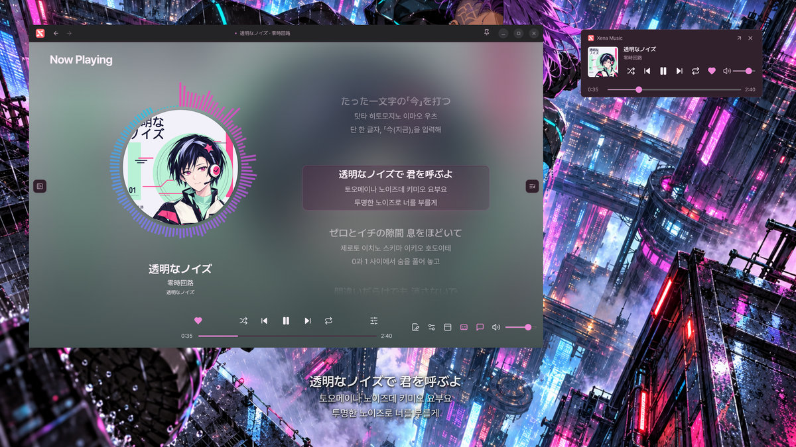 앱 · 미니 플레이어 · 데스크톱 가사</td>
  </tr>
</table>

## 가사

<table>
  <tr>
    <td width="50%" align="center"> 데스크톱 가사와 미니 플레이어</td>
    <td width="50%" align="center">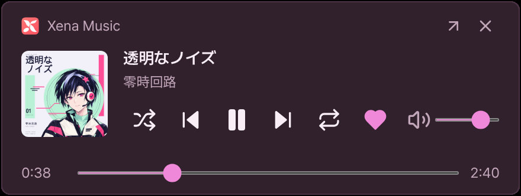 미니 플레이어</td>
  </tr>
  <tr>
    <td width="50%" align="center"> 싱크 가사 편집 · 원문·발음·번역</td>
    <td width="50%" align="center"> AI 자동 싱크</td>
  </tr>
  <tr>
    <td width="50%" align="center">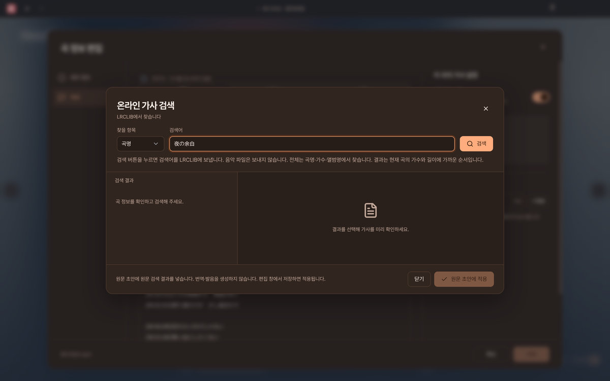 온라인 가사 검색</td>
    <td width="50%" align="center">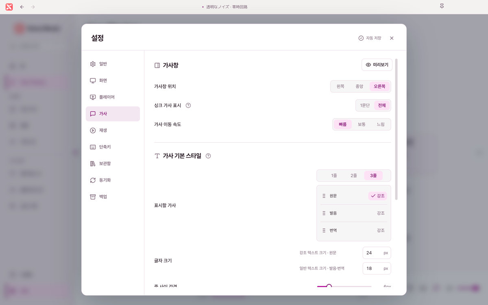 가사 설정</td>
  </tr>
</table>

## 음악 보관함

<table>
  <tr>
    <td width="50%" align="center"> 홈</td>
    <td width="50%" align="center">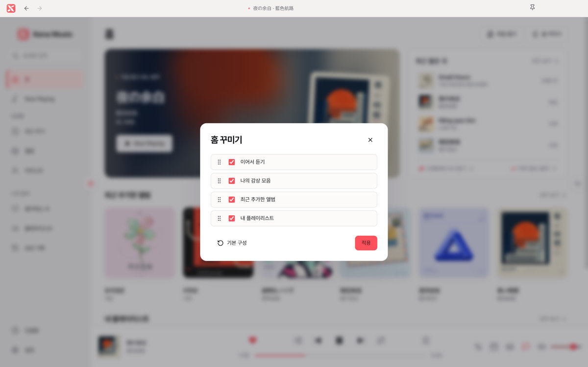 홈 꾸미기</td>
  </tr>
  <tr>
    <td width="50%" align="center"> 앨범</td>
    <td width="50%" align="center">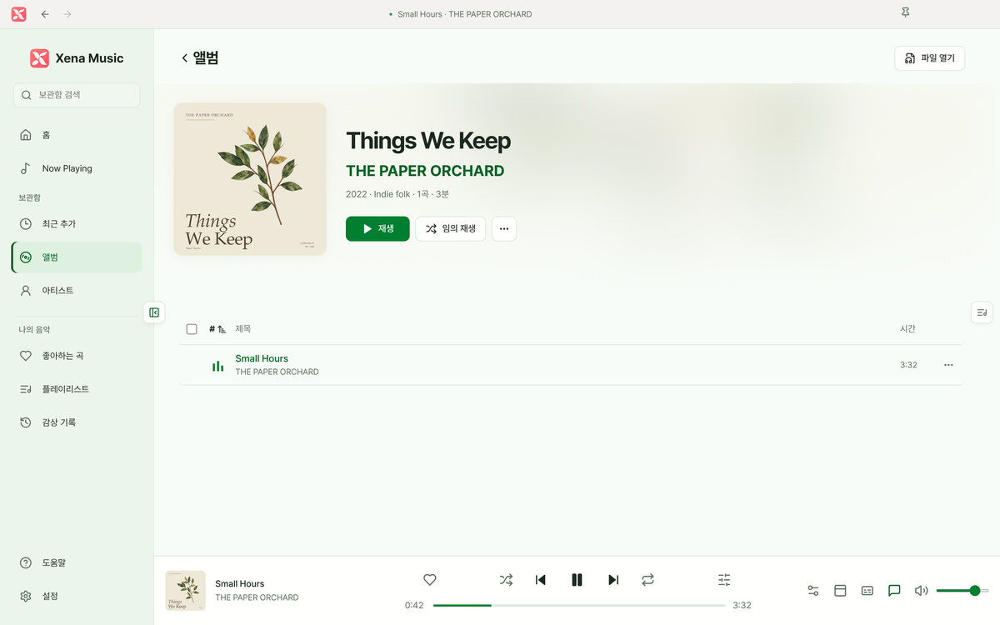 앨범 상세</td>
  </tr>
  <tr>
    <td width="50%" align="center"> 아티스트</td>
    <td width="50%" align="center">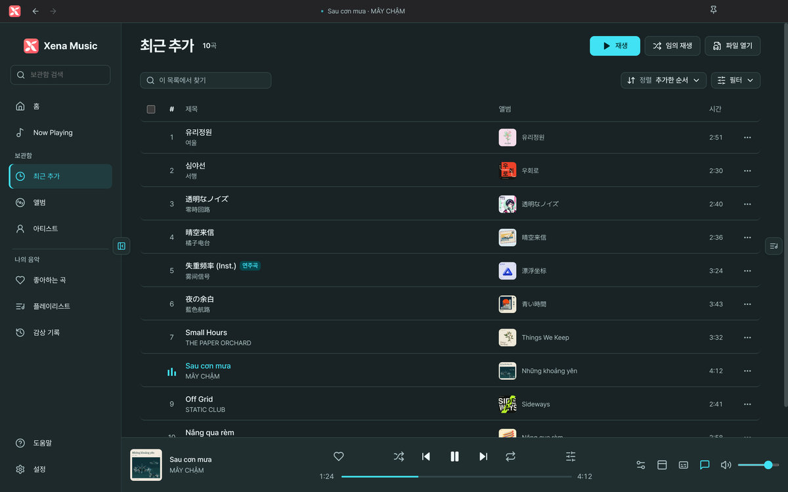 최근 추가</td>
  </tr>
  <tr>
    <td width="50%" align="center">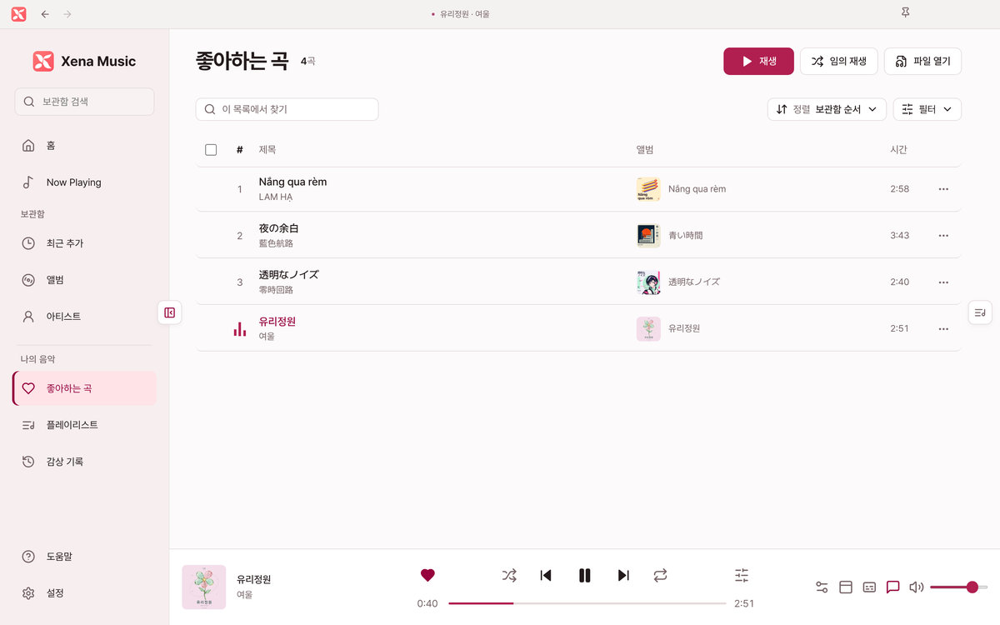 좋아하는 곡</td>
    <td width="50%" align="center"> 감상 기록</td>
  </tr>
  <tr>
    <td width="50%" align="center">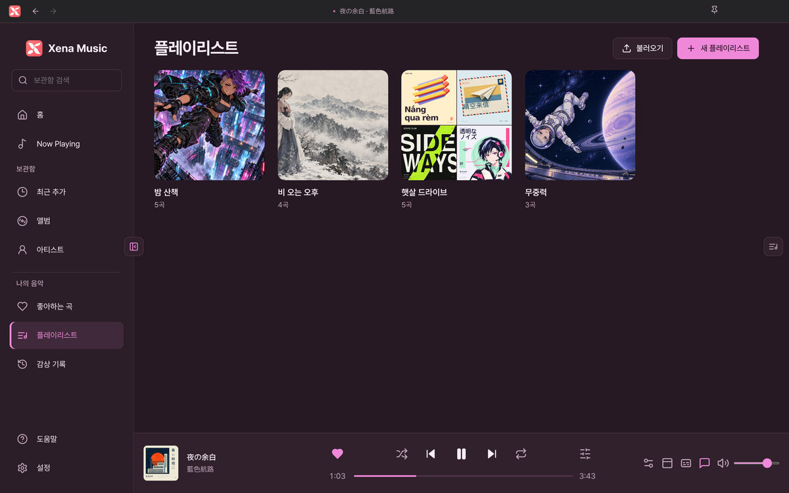 플레이리스트</td>
    <td width="50%" align="center"> 플레이리스트 상세</td>
  </tr>
  <tr>
    <td width="50%" align="center"> 가사까지 찾는 검색</td>
    <td width="50%"></td>
  </tr>
</table>

## 재생과 편집

<table>
  <tr>
    <td width="50%" align="center"> 10밴드 이퀄라이저</td>
    <td width="50%" align="center"> 크로스페이드 · 구간 반복 · 취침 예약</td>
  </tr>
  <tr>
    <td width="50%" align="center"> 곡 정보 편집</td>
    <td width="50%" align="center"> 온라인 앨범아트 검색</td>
  </tr>
</table>

## 설정

<table>
  <tr>
    <td width="50%" align="center">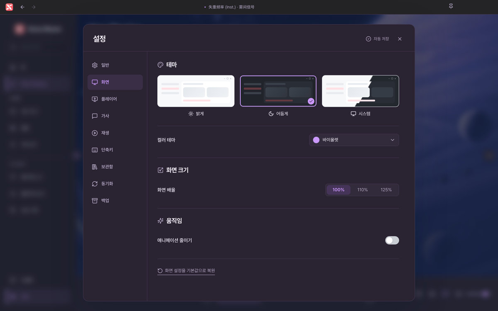 테마 · 컬러 테마 · 화면 배율</td>
    <td width="50%" align="center">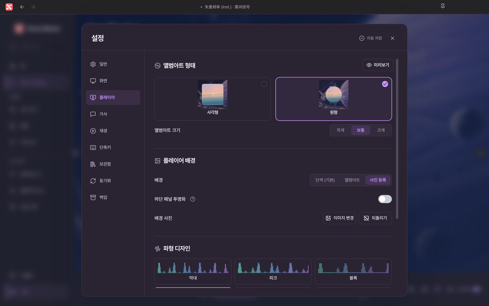 앨범아트 · 배경 · 파형</td>
  </tr>
  <tr>
    <td width="50%" align="center">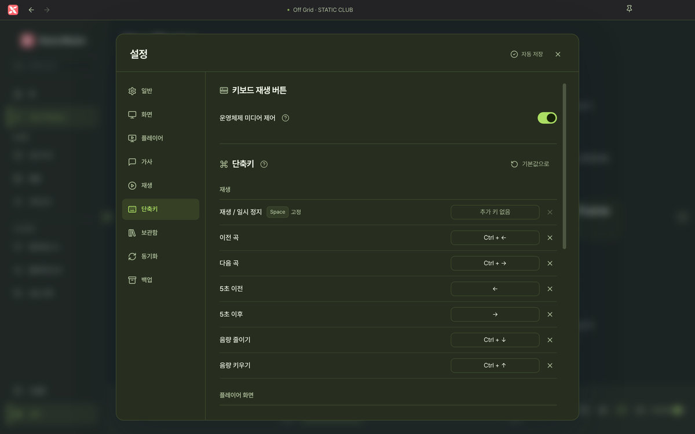 단축키</td>
    <td width="50%" align="center">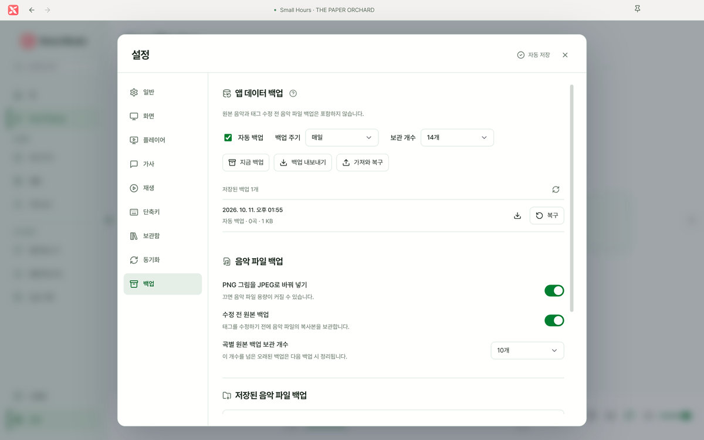 백업</td>
  </tr>
  <tr>
    <td width="50%" align="center">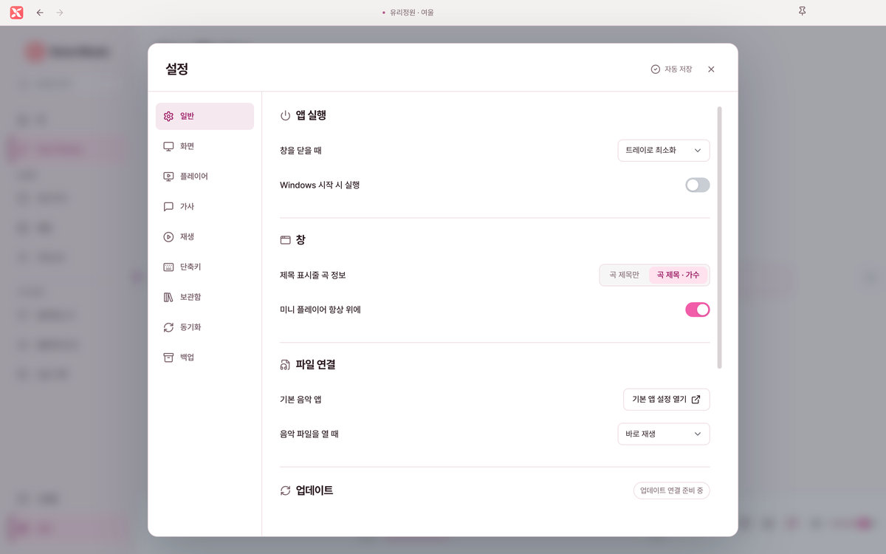 일반</td>
    <td width="50%"></td>
  </tr>
</table>
